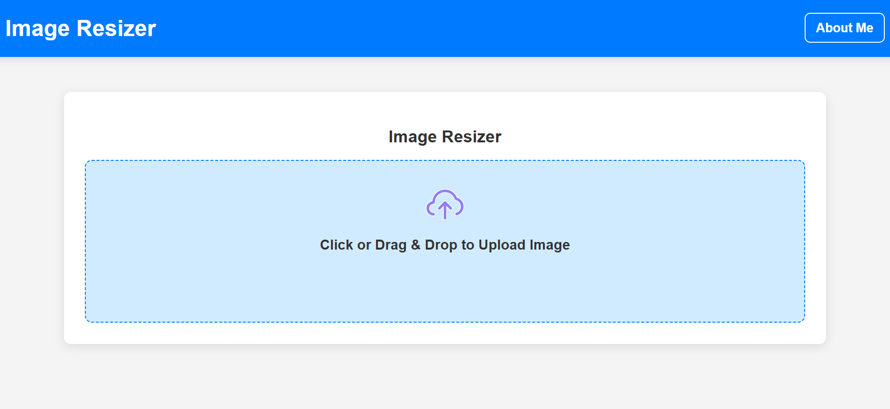
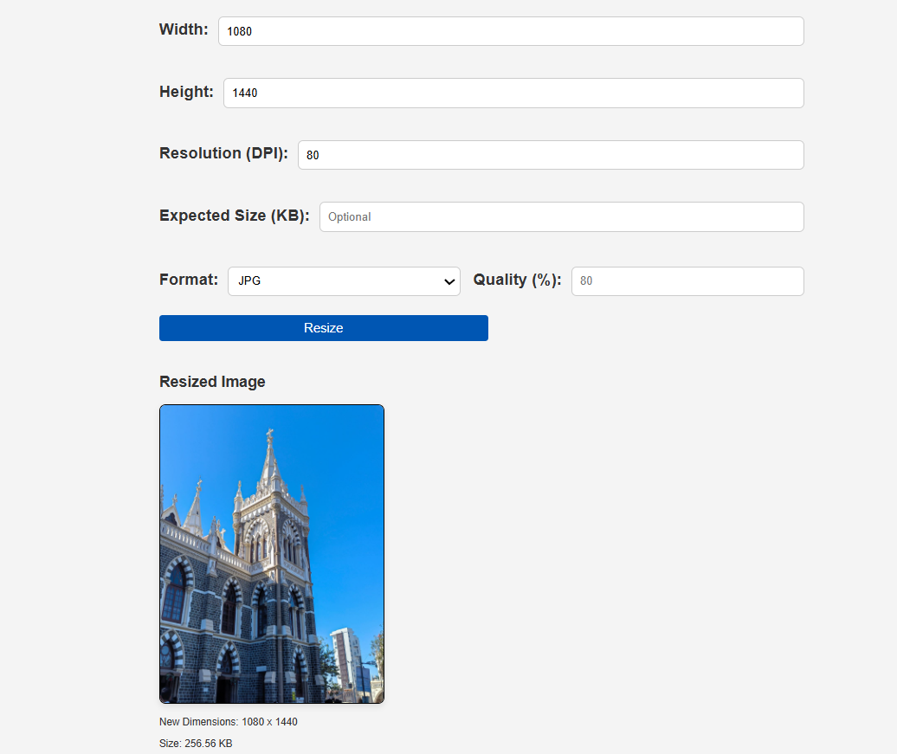

<div align="center">

<h1>🖼️ Image Resizer</h1>

<p>A clean, fast, and fully client-side image resizing tool — no uploads, no servers, no privacy concerns.</p>

[](https://image-resizer-gamma.vercel.app/)
[](https://github.com/yahskamrahs/Image-Resizer)
[](https://image-resizer-gamma.vercel.app/)

</div>

---

## 📸 Screenshots

> **Tip:** Replace the placeholders below with real screenshots from your app.  
> A quick way: open the live site, take a screenshot, and save them in a `screenshots/` folder in your repo.

| Upload & Configure | Resized Output |
|---|---|
|  |  |

---

## ✨ Features

- 📂 **Drag & Drop or Click to Upload** — simple, intuitive image input
- 📐 **Custom Width & Height** — set exact pixel dimensions for your output
- 🖨️ **DPI / Resolution Control** — adjust resolution for print or web use
- 📦 **Target File Size (KB)** — set an expected output size target
- 🎨 **Format Conversion** — export as **JPG**, **PNG**, or **WEBP**
- 🎚️ **Quality Slider** — fine-tune compression from 1–100%
- 👁️ **Live Preview** — see the image before and after resizing
- ⬇️ **One-Click Download** — instantly download the resized image
- 🔒 **100% Client-Side** — all processing happens in your browser; your images never leave your device

---

## 🛠️ Tech Stack

| Technology | Purpose |
|---|---|
| **HTML5** | Structure & Canvas API for image processing |
| **CSS3** | Styling & responsive layout |
| **JavaScript (Vanilla)** | Core resize logic, drag-and-drop, file handling |
| **Canvas API** | In-browser image manipulation |
| **Vercel** | Hosting & deployment |

---

## 🚀 Getting Started

### Prerequisites

All you need is a modern web browser. No installs, no dependencies.

### Run Locally

```bash
# 1. Clone the repository
git clone https://github.com/yahskamrahs/Image-Resizer.git

# 2. Navigate into the project folder
cd Image-Resizer

# 3. Open index.html in your browser
open index.html
# or just double-click index.html in your file explorer
```

No build step required — it's plain HTML, CSS, and JavaScript.

---

## 📖 How to Use

1. **Upload an image** — click the upload area or drag and drop any image file
2. **Set dimensions** — enter your desired **Width** and **Height** in pixels
3. **Adjust settings** — optionally configure DPI, target file size, output format, and quality
4. **Click "Resize"** — the tool processes the image instantly in your browser
5. **Download** — click **"Download Resized Image"** to save the result

---

## 📁 Project Structure

```
Image-Resizer/
├── index.html          # Main HTML page
├── assets/
│   └── upload.svg      # Upload icon/illustration
├── style.css           # Stylesheet (if separate)
├── script.js           # Resize logic (if separate)
└── README.md           # You are here
```

---

## 🌐 Live Demo

Try it live here → **[https://image-resizer-gamma.vercel.app/](https://image-resizer-gamma.vercel.app/)**

---

## 🤝 Contributing

Contributions are welcome! Here's how:

```bash
# 1. Fork the repository
# 2. Create a new branch
git checkout -b feature/your-feature-name

# 3. Make your changes and commit
git commit -m "Add: your feature description"

# 4. Push to your fork
git push origin feature/your-feature-name

# 5. Open a Pull Request on GitHub
```

---

## 📄 License

This project is open source. See the [LICENSE](LICENSE) file for details.

---

## 👤 Author

**Yahska Mrahs**

- 🌐 Portfolio: [yahska-amrahs.vercel.app](https://yahska-amrahs.vercel.app/)
- 🐙 GitHub: [@yahskamrahs](https://github.com/yahskamrahs)

---

<div align="center">

Made with ❤️ and deployed on Vercel

⭐ If you found this useful, please **star the repo**!

</div>
